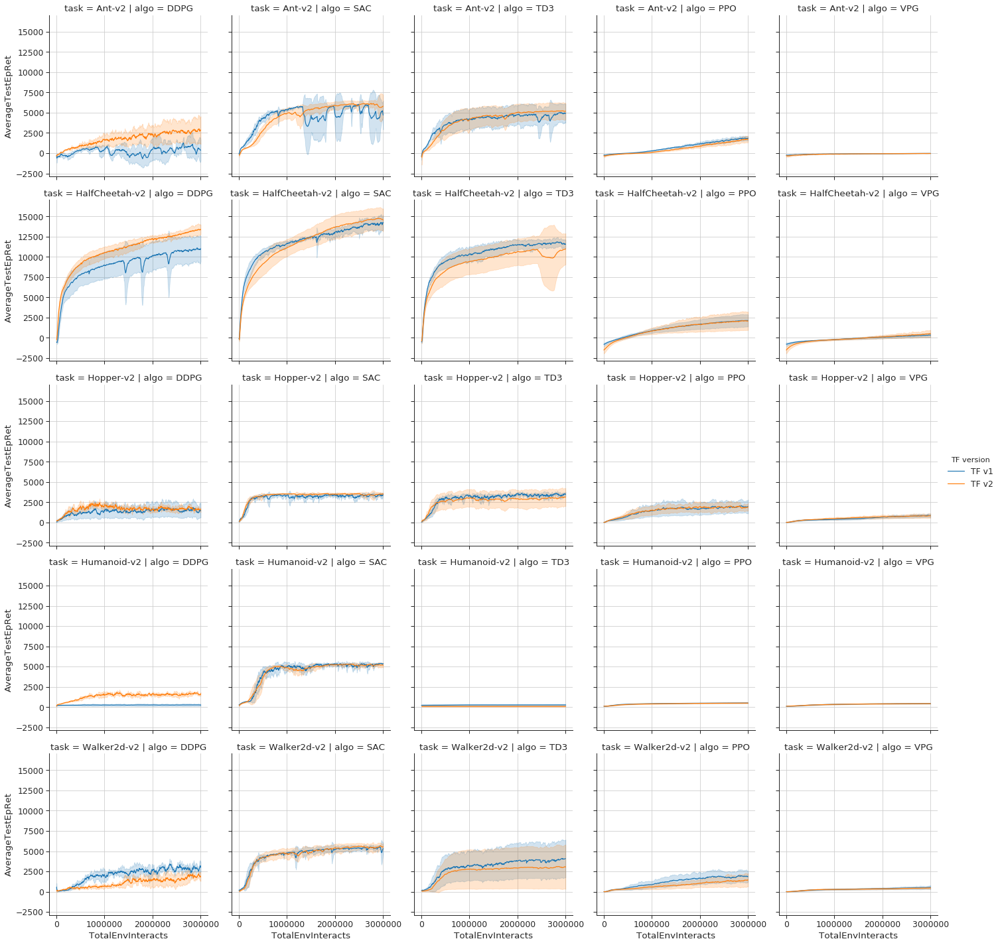

# Spinning Up in Deep RL - TF2 implementation

This repository includes ports of the algorithms from [Spinning Up in Deep RL](https://github.com/openai/spinningup) to TensorFlow v2

## Installation

### TL;DR

Make sure you have installed OpenMPI on your machine and then run `$ pip install -e .` in this repository root directory.

### Step by step

Follow the installation manual of the Spinning Up [here](https://spinningup.openai.com/en/latest/user/installation.html). However, remember that you're supposed to clone this repository instead of the original Spinning Up one in the `Installing Spinning Up` step. Note that the `Check Your Install` part won't work. Support of the original SpinUp commands is in our "Road map".

## Running

See the `run_example.py` and inspect the algorithms docstrings for details on the parameters available. The `run_policy.py` script allows you to run and visualize the saved checkpoints. Note: it is prepared for a SAC's checkpoint.

### Neptune logging

This code supports config and metrics logging to the [Neptune.ai](https://neptune.ai) platform. You need to specify two environment variables: `NEPTUNE_API_TOKEN` and `NEPTUNE_PROJECT_NAME`. See `run_example.py` for details.

## Performance

We compare the implementations in TF1 from the original SpinUp repository with our TF2 implementations.

**Experimentation details:**

* Graphs show mean (solid line) and std. dev. (shaded) calculated with 5 seeds. The results are smoothed using the exponential moving average with alpha=0.9.
    * See the `etc/compare_performance.ipynb` notebook for details on how the graphs were generated.
* Performance for the off-policy algorithms is measured by running the deterministic policy (or, in the case of SAC, the mean policy) without action noise.
* Performance for the on-policy algorithms is measured as the average trajectory return across the batch collected at each epoch.
* Default hyper-parameters for each algorithm were used. See the algorithm implementations for details.

## Contributors

Big thanks go to all the people who had helped this project so far. Names sorted alphabetically:

Mateusz Olko ([@MateuszOlko](https://github.com/MateuszOlko)): Thank you for porting the TD3 algorithm.  
Michał Królikowski ([@szarki](https://github.com/szarki)): Thank you for porting the DDPG algorithm.  
Michał Zając ([@zajaczajac](https://github.com/zajaczajac)): Thank you for porting the SAC algorithm.  
Michał Zawalski ([@do-not-be-hasty](https://github.com/do-not-be-hasty)): Thank you for porting the VPG and PPO algorithms and adding the MPI support.  
Piotr Januszewski ([@piojanu](https://github.com/piojanu)): Thank you for the SAC and DDPG code improvements and benchmarks, the results visualization, and for leading the efforts.  
Piotr Miłoś ([@piotrmilos](https://github.com/piotrmilos)): Thank you for your advice.  

Special thanks for the "Spinning Up in Deep RL" author Josh Achiam ([@jachiam](https://github.com/jachiam)), this is an amazing and incredibly valuable resource!

## Road map

Some features are not yet implemented.

* TRPO is not included.
* Original SpinUp running utils (plotting results, testing agents, experiment grids, etc.) aren't ported.

You are very welcome to contribute! Please read [CONTRIBUTING.md](./CONTRIBUTING.md) first.
